# DevOps Project Report: Automated CI/CD Pipeline for a 2-Tier Node.js Application on AWS

**Author:** Sureshkumar
**Date:** Jan 2315, 2026


A complete two-tier web application with Angular frontend, Node.js/Express backend, MySQL database, Docker containerization, and Jenkins CI/CD pipeline.

### **Table of Contents**

1. [Project Overview](#1-project-overview)
2. [Architecture Diagram](#2-architecture-diagram)
3. [Step 1: AWS EC2 Instance Preparation](#3-step-1-aws-ec2-instance-preparation)
4. [Step 2: Install Dependencies on EC2](#4-step-2-install-dependencies-on-ec2)
5. [Step 3: Jenkins Installation and Setup](#5-step-3-jenkins-installation-and-setup)
6. [Step 5: Jenkins Pipeline Creation and Execution](#6-step-5-jenkins-pipeline-creation-and-execution)
7. [Conclusion](#7-conclusion)
8. [Infrastructure Diagram](#8-infrastructure-diagram)
9. [Work flow Diagram](#9-work-flow-diagram)
- [API Documentation](#api-documentation)
- [Testing](#testing)
- [Troubleshooting](#troubleshooting) yes

### **1. Project Overview**
This document outlines the step-by-step process for deploying a 2-tier web application (Angular + Node.js + MySQL) on an AWS EC2 instance. The deployment is containerized using Docker and Docker Compose. A full CI/CD pipeline is established using Jenkins to automate the build and deployment process whenever new code is pushed to a GitHub repository.


### **2. Architecture Diagram**

```
+-----------------+      +----------------------+      +-----------------------------+
|   Developer     |----->|     GitHub Repo      |----->|        Jenkins Server       |
| (pushes code)   |      | (Source Code Mgmt)   |      |  (on AWS EC2)               |
+-----------------+      +----------------------+      |                             |
                                                       | 1. Clones Repo              |
                                                       | 2. Builds Docker Image      |
                                                       | 3. Runs Docker Compose      |
                                                       +--------------+--------------+
                                                                      |
                                                                      | Deploys
                                                                      v
                                                       +-----------------------------+
                                                       |      Application Server     |
                                                       |      (Same AWS EC2)         |
                                                       |                             |
                                                       | +-------------------------+ |
                                                       | | Docker Container:       | |
                                                       | | Frontend (Nginx)        | |
                                                       | +-------------------------+ |
                                                       |              |              |
                                                       |              v              |
                                                       | +-------------------------+ |
                                                       | | Docker Container:       | |
                                                       | | Backend (Node.js)       | |
                                                       | +-------------------------+ |
                                                       |              |              |
                                                       |              v              |
                                                       | +-------------------------+ |
                                                       | | Docker Container: MySQL | |
                                                       | +-------------------------+ |
                                                       +-----------------------------+
```


## ☁️ AWS EC2 Deployment

### **3. Step 1: AWS EC2 Instance Preparation**

1.  **Launch EC2 Instance:**
    * Navigate to the AWS EC2 console.
    * Launch a new instance using the **Ubuntu 22.04 LTS** AMI.
    * Select the **t2.micro** instance type for free-tier eligibility.
    * Create and assign a new key pair for SSH access.

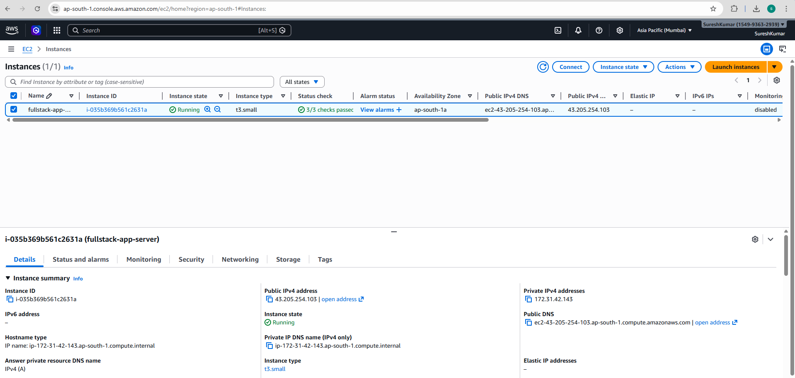

2.  **Configure Security Group:**
    * Create a security group with the following inbound rules:
        * **Type:** SSH, **Protocol:** TCP, **Port:** 22, **Source:** Your IP
        * **Type:** HTTP, **Protocol:** TCP, **Port:** 80, **Source:** Anywhere (0.0.0.0/0)
        * **Type:** Custom TCP, **Protocol:** TCP, **Port:** 5000 (for Backend API), **Source:** Anywhere (0.0.0.0/0)
        * **Type:** Custom TCP, **Protocol:** TCP, **Port:** 8080 (for Jenkins), **Source:** Anywhere (0.0.0.0/0)
         * **Type:** Custom TCP, **Protocol:** TCP, **Port:** 3306 (for MySQL - only if external access needed), **Source:** Anywhere (0.0.0.0/0)

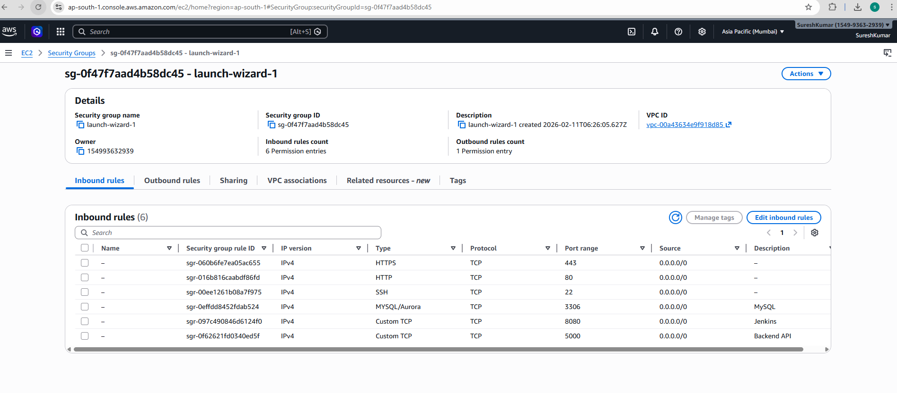

3.  **Connect to EC2 Instance:**
    * Use SSH to connect to the instance's public IP address.
    ```bash
    ssh -i /path/to/key.pem ubuntu@<ec2-public-ip>
    ```

### **4. Step 2: Install Dependencies on EC2**

1.  **Update System Packages:**
    ```bash
    sudo apt update && sudo apt upgrade -y
    ```

2.  **Install Git, Docker, and Docker Compose:**
    ```bash
    sudo apt install git docker.io docker-compose-v2 -y
    ```

3.  **Start and Enable Docker:**
    ```bash
    sudo systemctl start docker
    sudo systemctl enable docker
    ```

4.  **Add User to Docker Group (to run docker without sudo):**
    ```bash
    sudo usermod -aG docker $USER
    newgrp docker
    ```

### **5. Step 3: Jenkins Installation and Setup**

1.  **Install Java (OpenJDK 17):**
    ```bash
    sudo apt install openjdk-17-jdk -y
    ```

2.  **Add Jenkins Repository and Install:**
    ```bash
    curl -fsSL [https://pkg.jenkins.io/debian-stable/jenkins.io-2023.key](https://pkg.jenkins.io/debian-stable/jenkins.io-2023.key) | sudo tee /usr/share/keyrings/jenkins-keyring.asc > /dev/null
    echo deb [signed-by=/usr/share/keyrings/jenkins-keyring.asc] [https://pkg.jenkins.io/debian-stable](https://pkg.jenkins.io/debian-stable) binary/ | sudo tee /etc/apt/sources.list.d/jenkins.list > /dev/null
    sudo apt update
    sudo apt install jenkins -y
    ```

3.  **Start and Enable Jenkins Service:**
    ```bash
    sudo systemctl start jenkins
    sudo systemctl enable jenkins
    ```

4.  **Initial Jenkins Setup:**
    * Retrieve the initial admin password:
        ```bash
        sudo cat /var/lib/jenkins/secrets/initialAdminPassword
        ```
    * Access the Jenkins dashboard at `http://<ec2-public-ip>:8080`.
    * Paste the password, install suggested plugins, and create an admin user.

5.  **Grant Jenkins Docker Permissions:**
    ```bash
    sudo usermod -aG docker jenkins
    sudo systemctl restart jenkins
    ```
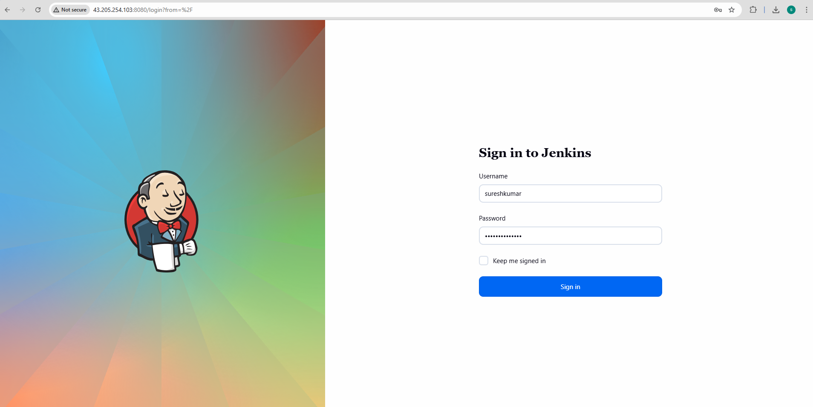

---

### **7. Step 5: Jenkins Pipeline Creation and Execution**

1.  **Create a New Pipeline Job in Jenkins:**
    * From the Jenkins dashboard, select **New Item**.
    * Name the project, choose **Pipeline**, and click **OK**.

2.  **Configure the Pipeline:**
    * In the project configuration, scroll to the **Pipeline** section.
    * Set **Definition** to **Pipeline script from SCM**.
    * Choose **Git** as the SCM.
    * Enter your GitHub repository URL.
    * Verify the **Script Path** is `Jenkinsfile`.
    * Save the configuration.

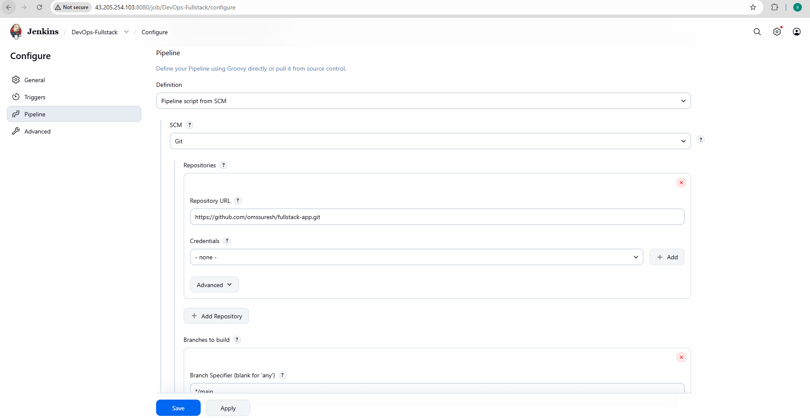

3.  **Run the Pipeline:**
    * Click **Build Now** to trigger the pipeline manually for the first time.
    * Monitor the execution through the **Stage View** or **Console Output**.

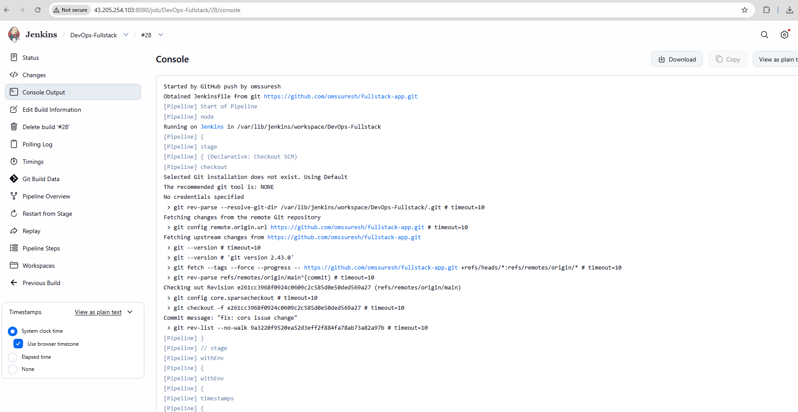
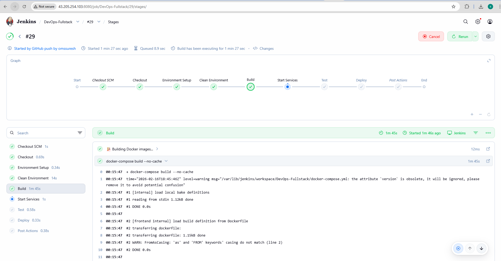

4.  **Verify Deployment:**
    * After a successful build, your Node.js application will be accessible at `http://<your-ec2-public-ip>:5000`.
    * Confirm the containers are running on the EC2 instance with `docker ps`.


### 5. Configure GitHub Webhook

1. Go to your GitHub repository settings
2. Navigate to "Webhooks"
3. Click "Add webhook"
4. **Payload URL:** `http://YOUR_EC2_IP:8080/github-webhook/`
5. **Content type:** application/json
6. **Events:** Just the push event
7. Click "Add webhook"

### 6. Test the Pipeline

Push a commit to your repository and watch Jenkins automatically:
1. Checkout code
2. Build Docker images
3. Run integration tests
4. Deploy the application

### **7. Conclusion**
The CI/CD pipeline is now fully operational. Any `git push` to the `main` branch of the configured GitHub repository will automatically trigger the Jenkins pipeline, which will build the new Docker image and deploy the updated application, ensuring a seamless and automated workflow from development to production.

## Application Pages
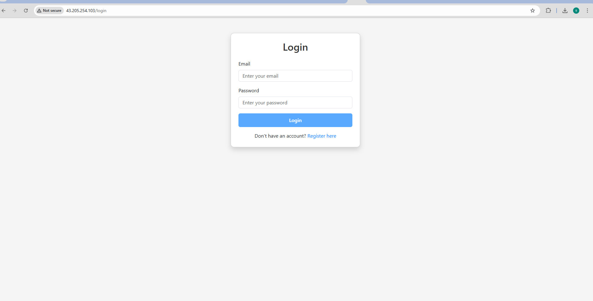
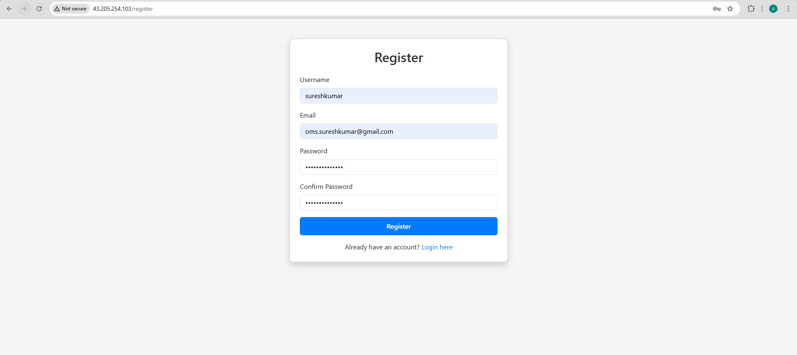

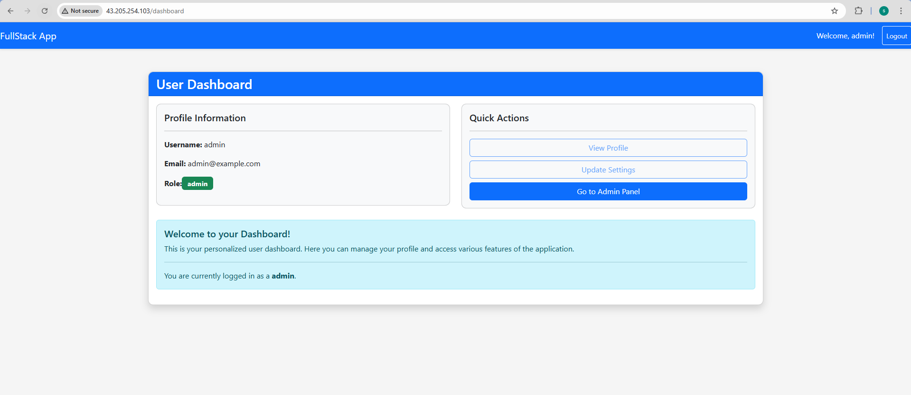


### **8. Infrastructure Diagram**
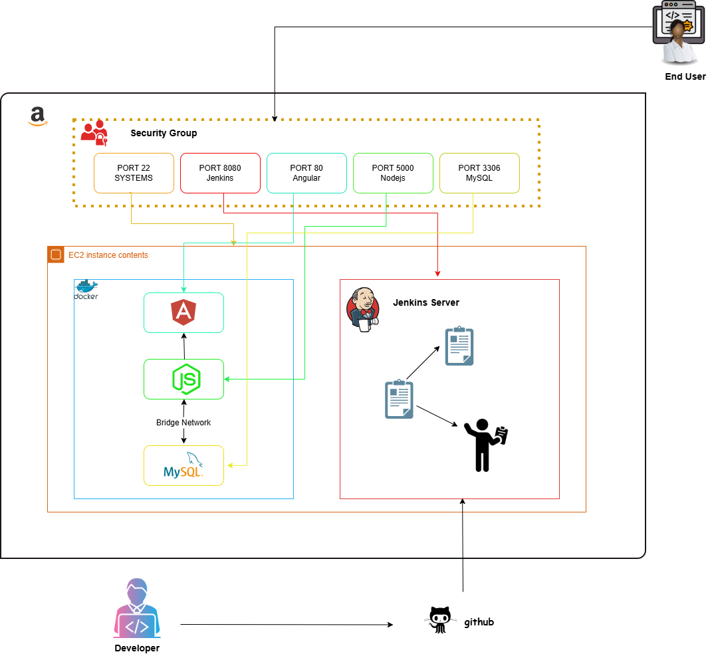


### **9. Work flow Diagram**
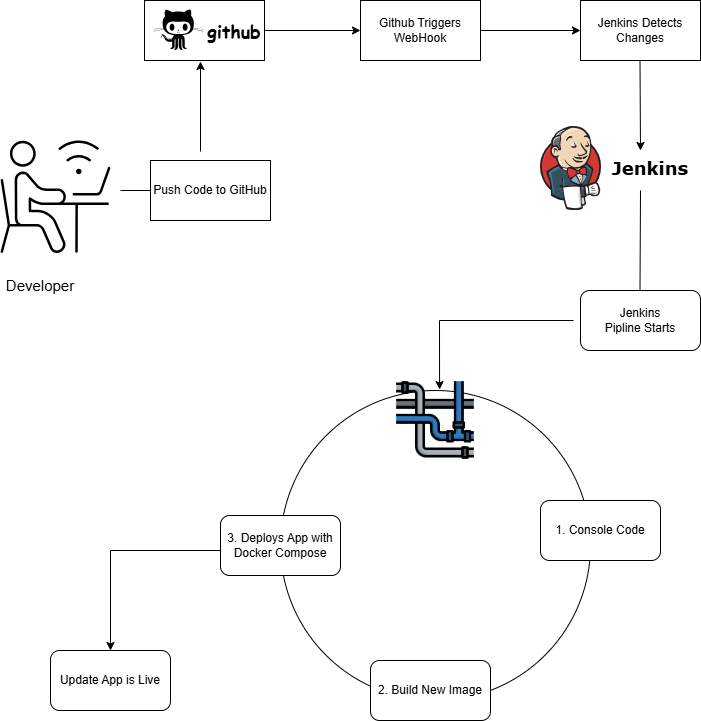

## 📡 API Documentation

### Authentication Endpoints

#### Register User
```http
POST /api/register
Content-Type: application/json

{
  "username": "johndoe",
  "email": "john@example.com",
  "password": "SecurePass123"
}
```

#### Login
```http
POST /api/login
Content-Type: application/json

{
  "email": "john@example.com",
  "password": "SecurePass123"
}
```

#### Get Profile (Protected)
```http
GET /api/profile
Authorization: Bearer YOUR_JWT_TOKEN
```

### Admin Endpoints

#### Get All Users (Admin Only)
```http
GET /api/admin/users
Authorization: Bearer ADMIN_JWT_TOKEN
```

#### Update User Role (Admin Only)
```http
PUT /api/admin/users/:id
Authorization: Bearer ADMIN_JWT_TOKEN
Content-Type: application/json

{
  "role": "admin"
}
```

#### Delete User (Admin Only)
```http
DELETE /api/admin/users/:id
Authorization: Bearer ADMIN_JWT_TOKEN
```

### Response Format

All API responses follow this format:

```json
{
  "success": true,
  "message": "Operation successful",
  "data": {
    // Response data here
  }
}
```

## 🧪 Testing

### Run Integration Tests

```bash
# Ensure application is running
docker-compose up -d

# Run tests
./tests/integration-tests.sh
```

### Test Coverage

The integration tests verify:
- ✅ All containers are running
- ✅ Service health checks
- ✅ Database connectivity
- ✅ User registration
- ✅ User login
- ✅ JWT authentication
- ✅ Protected route access control
- ✅ Admin endpoint protection
- ✅ Frontend accessibility
- ✅ CORS configuration

## 🐛 Troubleshooting

### Issue: Containers won't start

```bash
# Check logs
docker-compose logs

# Rebuild containers
docker-compose down -v
docker-compose up --build
```

### Issue: Database connection failed

```bash
# Check if MySQL is healthy
docker-compose ps

# Verify MySQL credentials in .env file
# Wait for MySQL to fully initialize (can take 30-60 seconds)
```

### Issue: Frontend can't connect to backend

```bash
# Verify backend is running
curl http://localhost:5000/health

# Check CORS configuration in backend
# Verify FRONTEND_URL in .env matches your frontend URL
```

### Issue: Jenkins can't build Docker images

```bash
# Ensure Jenkins user is in docker group
sudo usermod -aG docker jenkins
sudo systemctl restart jenkins
```

### Issue: Port already in use

```bash
# Find process using port
sudo lsof -i :PORT_NUMBER

# Stop the process or change port in docker-compose.yml
```

## ✨ Features

### Frontend (Angular)
- ✅ User registration with validation
- ✅ User login with JWT authentication
- ✅ Role-based access control (Admin/User)
- ✅ Protected routes with guards
- ✅ HTTP interceptor for automatic token attachment
- ✅ Responsive design with Bootstrap
- ✅ Admin dashboard for user management
- ✅ User dashboard with personalized content

### Backend (Node.js/Express)
- ✅ RESTful API architecture
- ✅ JWT token-based authentication
- ✅ Password encryption with bcrypt
- ✅ Input validation and sanitization
- ✅ Role-based middleware
- ✅ MySQL database integration
- ✅ Error handling middleware
- ✅ CORS configuration
- ✅ Security headers with Helmet

### DevOps
- ✅ Docker containerization
- ✅ Multi-stage Docker builds
- ✅ Docker Compose orchestration
- ✅ Health checks for all services
- ✅ Persistent data volumes
- ✅ Jenkins pipeline automation
- ✅ Integration tests
- ✅ AWS EC2 deployment ready

## 🛠️ Technology Stack

**Frontend:**
- Angular 17
- TypeScript
- Bootstrap 5
- RxJS

**Backend:**
- Node.js
- Express.js
- MySQL2
- JWT (jsonwebtoken)
- bcrypt
- express-validator

**Database:**
- MySQL 8.0

**DevOps:**
- Docker & Docker Compose
- Jenkins
- Nginx
- AWS EC2
```

## 🔐 Security Considerations

1. **Change Default Credentials:** Always change default admin password
2. **Environment Variables:** Never commit .env files to version control
3. **JWT Secret:** Use a strong, random JWT secret (min 32 characters)
4. **Database Password:** Use strong database passwords
5. **HTTPS:** Enable HTTPS in production (use Let's Encrypt)
6. **Security Headers:** Helmet middleware adds security headers
7. **Input Validation:** All inputs are validated and sanitized
8. **SQL Injection:** Using parameterized queries prevents SQL injection
9. **XSS Protection:** Content Security Policy headers prevent XSS


