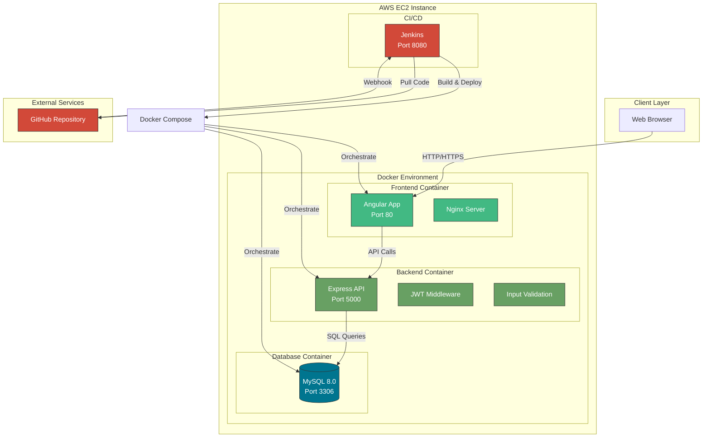
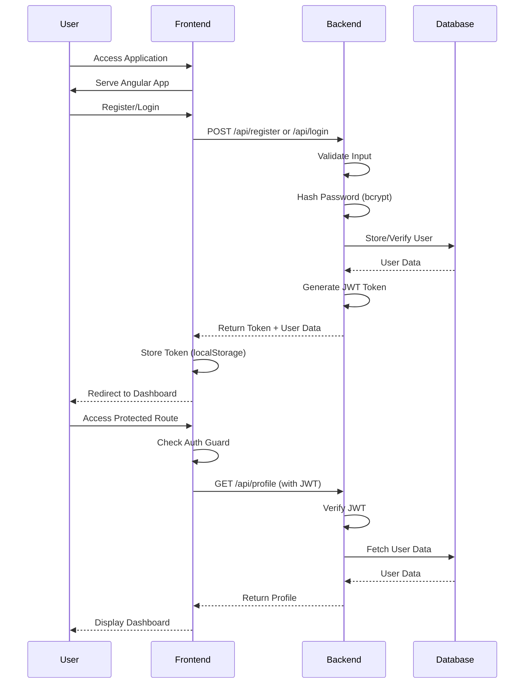
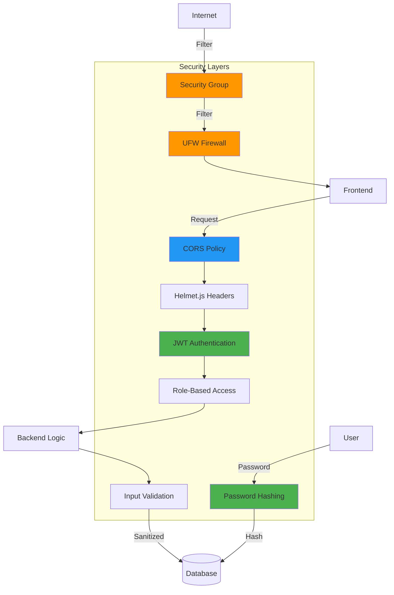
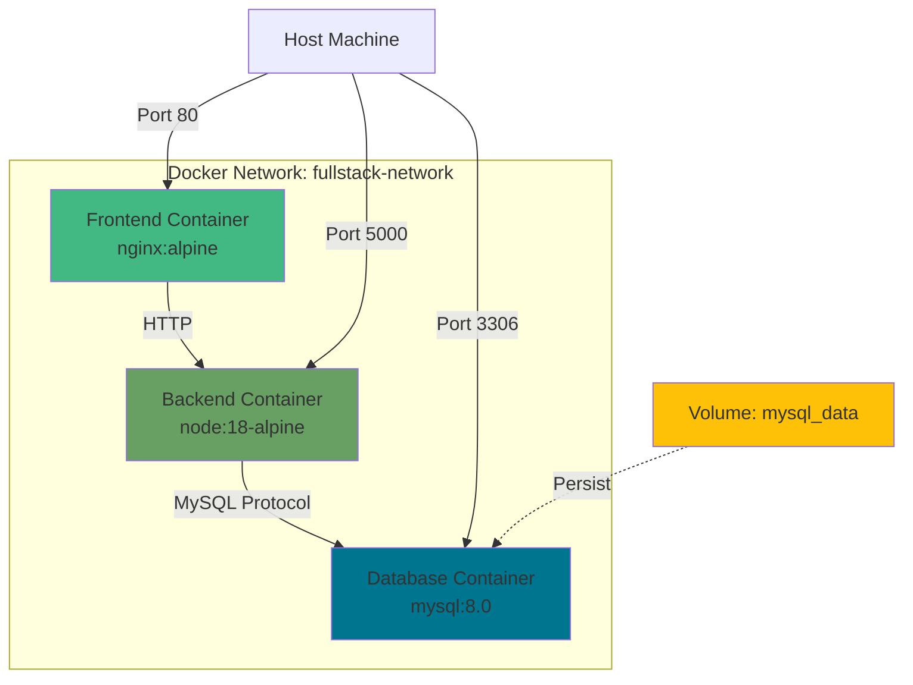

# System Architecture Diagram

```mermaid
graph TB
    subgraph "Client Layer"
        Browser[Web Browser]
    end

    subgraph "AWS EC2 Instance"
        subgraph "Docker Environment"
            subgraph "Frontend Container"
                Angular[Angular App<br/>Port 80]
                Nginx[Nginx Server]
            end
            
            subgraph "Backend Container"
                Express[Express API<br/>Port 5000]
                JWT[JWT Middleware]
                Validation[Input Validation]
            end
            
            subgraph "Database Container"
                MySQL[(MySQL 8.0<br/>Port 3306)]
            end
        end
        
        subgraph "CI/CD"
            Jenkins[Jenkins<br/>Port 8080]
        end
    end

    subgraph "External Services"
        GitHub[GitHub Repository]
    end

    Browser -->|HTTP/HTTPS| Angular
    Angular -->|API Calls| Express
    Express -->|SQL Queries| MySQL
    
    GitHub -->|Webhook| Jenkins
    Jenkins -->|Pull Code| GitHub
    Jenkins -->|Build & Deploy| Docker[Docker Compose]
    Docker -->|Orchestrate| Angular
    Docker -->|Orchestrate| Express
    Docker -->|Orchestrate| MySQL

    classDef frontend fill:#42b983,stroke:#333,color:#fff
    classDef backend fill:#68a063,stroke:#333,color:#fff
    classDef database fill:#00758f,stroke:#333,color:#fff
    classDef cicd fill:#d24939,stroke:#333,color:#fff
    
    class Angular,Nginx frontend
    class Express,JWT,Validation backend
    class MySQL database
    class Jenkins,GitHub cicd
```

## Data Flow

```mermaid
sequenceDiagram
    participant U as User
    participant F as Frontend
    participant B as Backend
    participant D as Database

    U->>F: Access Application
    F->>U: Serve Angular App
    
    U->>F: Register/Login
    F->>B: POST /api/register or /api/login
    B->>B: Validate Input
    B->>B: Hash Password (bcrypt)
    B->>D: Store/Verify User
    D-->>B: User Data
    B->>B: Generate JWT Token
    B-->>F: Return Token + User Data
    F->>F: Store Token (localStorage)
    F-->>U: Redirect to Dashboard

    U->>F: Access Protected Route
    F->>F: Check Auth Guard
    F->>B: GET /api/profile (with JWT)
    B->>B: Verify JWT
    B->>D: Fetch User Data
    D-->>B: User Data
    B-->>F: Return Profile
    F-->>U: Display Dashboard
```

## Deployment Pipeline

```mermaid
graph LR
    A[Developer Push] -->|Commit| B[GitHub]
    B -->|Webhook| C[Jenkins]
    C -->|Checkout| D[Pull Code]
    D --> E[Build Images]
    E --> F[Run Tests]
    F -->|Pass| G[Deploy]
    F -->|Fail| H[Notify]
    G --> I[Running App]
    
    style A fill:#4CAF50
    style B fill:#181717
    style C fill:#D24939
    style I fill:#2196F3
```

## Security Architecture

```mermaid
graph TB
    subgraph "Security Layers"
        SG[Security Group]
        UFW[UFW Firewall]
        CORS[CORS Policy]
        Helmet[Helmet.js Headers]
        JWT[JWT Authentication]
        RBAC[Role-Based Access]
        Bcrypt[Password Hashing]
        Validation[Input Validation]
    end

    Internet[Internet] -->|Filter| SG
    SG -->|Filter| UFW
    UFW --> Frontend[Frontend]
    Frontend -->|Request| CORS
    CORS --> Helmet
    Helmet --> JWT
    JWT --> RBAC
    RBAC --> Backend[Backend Logic]
    Backend --> Validation
    Validation -->|Sanitized| Database[(Database)]
    
    User[User] -->|Password| Bcrypt
    Bcrypt -->|Hash| Database

    style SG fill:#ff9800
    style UFW fill:#ff9800
    style CORS fill:#2196F3
    style JWT fill:#4CAF50
    style Bcrypt fill:#4CAF50
```

## Container Communication

```mermaid
graph TB
    subgraph "Docker Network: fullstack-network"
        F[Frontend Container<br/>nginx:alpine]
        B[Backend Container<br/>node:18-alpine]
        D[Database Container<br/>mysql:8.0]
        
        F -->|HTTP| B
        B -->|MySQL Protocol| D
    end
    
    Host[Host Machine] -->|Port 80| F
    Host -->|Port 5000| B
    Host -->|Port 3306| D
    
    V1[Volume: mysql_data] -.->|Persist| D

    style F fill:#42b983
    style B fill:#68a063
    style D fill:#00758f
    style V1 fill:#FFC107
```
